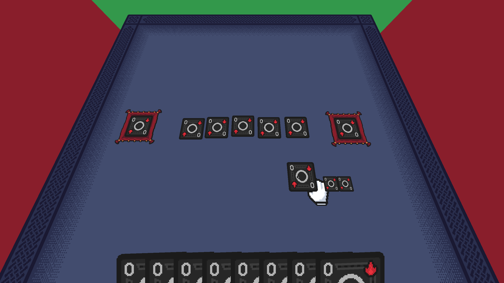

# Tabletop

## Preview:


## Info
Simple engine designed to run tabletop games over the network(WIP) with minimal graphics overhead.

## Requirements

Compile-time:
`zig >= 0.15`, `sdl >= 3`, `glslc`

Runtime:
`sdl >= 3`

## Compiling

Build:
```sh
zig build
```
Run:
```sh
zig build run
```
